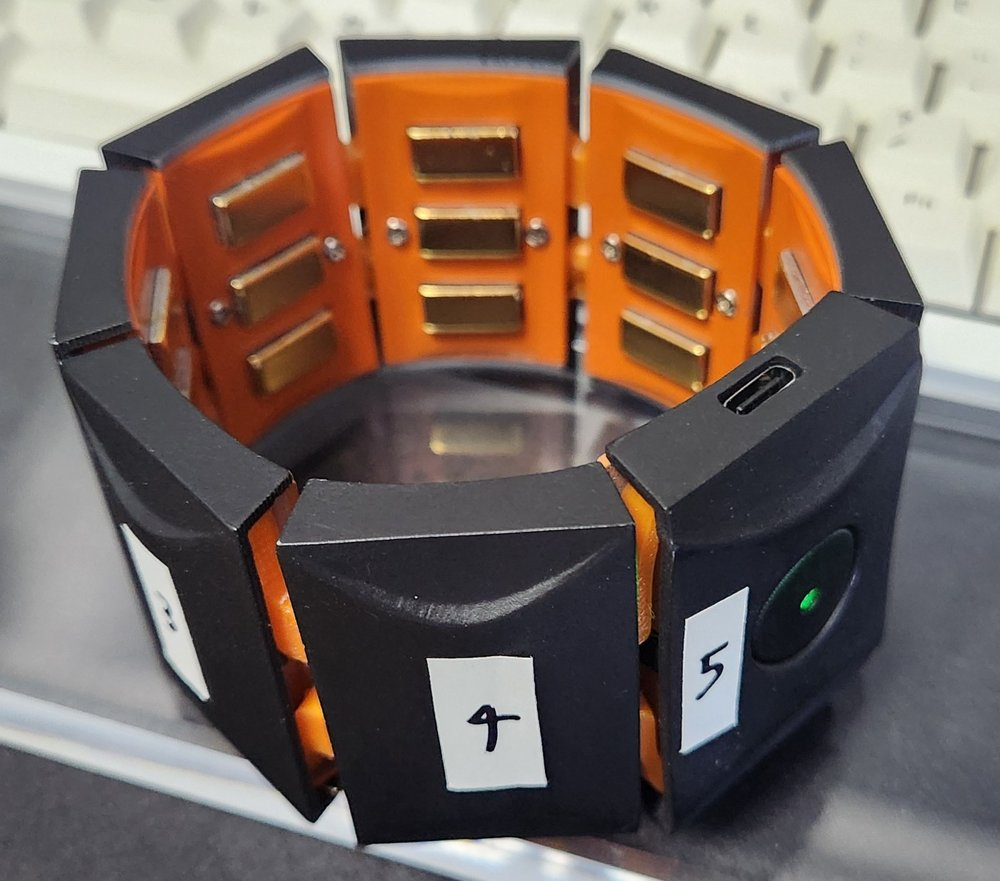

# EMG Studio

Multi-window workbench for the **Sichiray EMG PRO** 8-channel EMG armband: live signal views, noise diagnosis, a global filter chain, webcam 3D hand tracking (WiLoR, GPU), and on-the-spot learning of **EMG → hand pose** with the camera as ground truth. (문서는 한국어입니다.)

Sichiray EMG PRO 8채널 암밴드용 멀티 윈도우 작업대입니다. 암밴드 신호를 받아 보고, 필터링하고, 노이즈를 진단합니다. 웹캠으로 인식한 손을 정답으로 삼아 **EMG → 손 자세**를 현장에서 학습합니다.

## 요구 사항

- Windows 10/11, Python 3.12 (Studio)
- 암밴드 USB 동글(CH340) 드라이버. 장치가 없으면 `--demo`로 합성 신호를 씁니다.
- 카메라 손 인식은 NVIDIA GPU와 별도 Python 3.10 환경이 필요합니다(아래 설치 절). 없어도 나머지 창은 동작합니다.

## 실행

```powershell
python -m pip install -r requirements.txt
python emg_studio.py                                   # 런처에서 포트 선택(동글에 ★) → 연결 → 창 열기
python emg_studio.py --port COM4 --camera 0 --open all # 밴드 + 웹캠, 모든 창
python emg_studio.py --demo hex --open all             # 장치 없이 (합성 신호, 간섭을 일부러 섞음)
python -m pytest tests                                 # 회귀 테스트 (장치, GPU 불필요)
```

## 창

| 창 | 내용 |
|---|---|
| 카메라 손 인식 | 웹캠 영상 위에 오른손 21관절 뼈대를 겹쳐 그립니다. 손 인식은 WiLoR(GPU)이 별도 프로세스에서 합니다 |
| 3D 손 · EMG 복원 | 왼쪽은 EMG로 복원한 손, 오른쪽은 카메라 손(정답)입니다. **현장 학습**(수집 → 학습 → 예측)을 여기서 합니다 |
| EMG 원시 데이터 | 받은 정수를 가공 없이 보여줍니다(HEX 0~255 / ASCII 0~4095). 물리 채널 순서이고 IMU 9개 값도 함께 나옵니다 |
| 센서 정보 | 전송률, 샘플률, 프레임 누락과 재동기, 타임스탬프 간격, 배터리를 보여줍니다. HEX/ASCII 바이트 콘솔이 있습니다 |
| 스펙트로그램 · 노이즈 | 8채널 롤링 스펙트로그램, 현재 스펙트럼, 노이즈 진단표 13개 항목(항목에 마우스를 올리면 설명)을 보여줍니다 |
| 신호 처리 · 필터 | **전역** 고역·저역·전원 노치·추가 노치, 채널 회전과 끄기, 포락선, 휴식·최대 수축 보정을 설정합니다 |

- HEX/ASCII 모드는 자동으로 감지합니다. 밴드 버튼으로 모드를 바꿔도 다시 연결할 필요가 없습니다.
- 필터 설정은 모든 창에 바로 적용되고 `data/studio_settings.json`에 저장됩니다.
- COM 포트는 한 프로그램만 열 수 있습니다. 벤더 뷰어나 sscom이 켜져 있으면 연결되지 않습니다.
- 손 인식은 **오른손만** 합니다(밴드는 오른팔).

## 현장 학습 순서

1. 카메라 창에서 **시작**을 누릅니다.
2. 3D 창에서 **● 수집 시작**을 누르고, 1~2분 동안 손가락을 다양하게 움직입니다.
3. **■ 수집 중지** → **학습** → **EMG 예측**을 켭니다.

학습 결과에는 항상 두 가지 비교가 함께 나옵니다.
- **"평균 손으로 찍기"(아무것도 배우지 않은 모델) 대비 오차**
- **우연 판정**: 5초보다 느린 표류를 지운 뒤, 라벨을 시간축에서 40번 밀어 우연 분포와 비교합니다.

"우연과 구분되지 않음"이 나오면 EMG가 손 모양을 설명하지 못한 것입니다. 데이터는 필터를 거치기 전 상태로 저장하고, 학습할 때 현재 필터로 다시 걸러서 씁니다. 그래서 수집 한 번으로 필터를 바꿔 가며 비교할 수 있습니다. 필터 설정이 모델과 다르면 예측이 멈춥니다.

## 구조

```
emg_studio.py            진입점 (studio.ui.app.main)
worker/hand_worker.py    카메라 + WiLoR 손 인식. 별도 Python(손 인식 venv)에서 실행되며 studio를 import하지 않음
studio/
  config.py              경로, 포트, 환경 변수
  device/                protocol(프레임 규격), sources(시리얼·ByteSource), demo, parsers, clock(시각 정렬), stats, link
  core/                  ring, settings(FilterSpec·Calibration), filters, pipeline, calibration, streams, analysis, hub
  hand/                  camera_link(워커 프로세스·TCP, HandFrame), skeleton, mano_np(numpy MANO)
  pose/                  features, dataset, collector, models(릿지·MLP), evaluate(검증·우연 판정), trainer, learner
  ui/                    theme, common, gl_hand, win_* 6개, app(런처)
tests/                   회귀 테스트
data/                    실행 중 생기는 설정·수집·모델 (git 제외)
```

## 카메라 손 인식 설치 (PC당 한 번, 약 7.5 GB)

손 인식은 PyTorch(numpy<2 고정)를 쓰므로 별도 가상환경에서 돕니다. **Google Drive 폴더 밖**(`%USERPROFILE%\.emg_hand`)에 설치합니다. NVIDIA GPU와 `uv`가 필요합니다.

```bash
mkdir -p ~/.emg_hand && cd ~/.emg_hand
uv venv --python 3.10 venv
uv pip install --python venv/Scripts/python.exe torch==2.5.1 torchvision==0.20.1 --index-url https://download.pytorch.org/whl/cu124
uv pip install --python venv/Scripts/python.exe pip setuptools wheel "numpy<2" scipy dill
uv pip install --python venv/Scripts/python.exe --no-build-isolation "chumpy @ git+https://github.com/mattloper/chumpy"
uv pip install --python venv/Scripts/python.exe "numpy<2" smplx==0.1.28 timm einops ultralytics==8.1.34 opencv-python huggingface_hub scikit-image roma
uv pip install --python venv/Scripts/python.exe --no-deps "git+https://github.com/warmshao/WiLoR-mini"
```

- 모델(약 2.5 GB)은 첫 실행 때 `~/.emg_hand/models`로 자동으로 받습니다. 워커 로그는 `~/.emg_hand/worker.log`에 남습니다.
- 다른 위치의 파이썬을 쓰려면 `EMG_HAND_PY` 환경 변수로 지정합니다.

## 하드웨어 메모

### 장비 형태와 채널 번호



밴드는 셀 8개를 탄성 줄로 이은 링입니다. 셀마다 안쪽에 금도금 전극 3개가 있고, 전극 한 세트가 채널 하나입니다. 위 사진의 번호는 **각 셀의 전극을 손가락으로 하나씩 눌러 보며, 어느 채널에 반응이 나타나는지 확인해서** 붙인 것입니다.

| 셀 | 특징 |
|---|---|
| **CH5** | **USB-C 충전 포트와 초록 LED(전원·상태)가 달린 셀.** 이 셀 안에 메인 보드(STM32F411, 블루투스)와 CH5 아날로그 보드가 함께 들어 있습니다. 채널 번호를 맞출 때 기준으로 삼으면 됩니다 |
| CH4, CH3, … | USB-C 셀에서 사진 속 4 → 3 방향으로 번호가 하나씩 줄어듭니다. 링이라 CH1과 CH8은 서로 이웃합니다 |

- 착용할 때 밴드가 돌면 신호 패턴도 셀 단위로 통째로 돕니다. 필터 창의 **채널 회전**으로 보정합니다(논리 채널 k = 물리 채널 (k + 회전) mod 8).
- **알려진 하드웨어 결함(CH5):** USB-C 셀 안의 두 PCB(메인 보드 V1.3, 아날로그 보드 V1.2)가 절연층 없이 겹쳐 있습니다. 그래서 CH5에만 광대역 잡음, DC 오프셋, 포화가 생길 수 있습니다. 한 대에서 확인했고, 두 보드 사이에 절연테이프를 넣자 CH5 RMS가 66.5에서 13.0 카운트로, 포화가 8.7%에서 0%로, DC 오프셋이 +23.8에서 +0.3 카운트로 정상화되었습니다. 스펙트로그램 창에서 **CH5만** 0~250 Hz 전체가 밝고 채널 간 상관이 0에 가깝다면 이 문제를 의심하세요. 밴드를 돌려 차도 잡음이 CH5에 그대로 남으면 하드웨어 원인입니다.

### 사양과 프로토콜

| 항목 | 값 |
|---|---|
| EMG | 8ch. HEX 모드는 8-bit 500 Hz, ASCII 모드는 12-bit 67 Hz |
| IMU | 가속도, 자이로, 각도 각 3축, 50 Hz (HEX 모드만) |
| 통신 | Bluetooth 5.0 → USB 동글(CH340, VID 1A86/PID 7523), 115200 8N1 |
| 모드 | 전원을 켜면 HEX. 버튼 2번 클릭 = ASCII, 1번 = HEX. 매뉴얼의 3모드 순환은 없음(실측) |

HEX 프레임(98 B, 50 fps): `AA AA 5F | ts(4, BE ms) | Acc(3) Gyro(3) Angle(3) | EMG 10샘플×8ch | 배터리 | 55`

CH340 드라이버가 없으면 Microsoft Update 카탈로그에서 `USB\VID_1A86&PID_7523`을 검색해 `wch.cn 3.9.2024.9`를 받아 `pnputil /add-driver CH341SER.INF /install`로 설치합니다.

## 코드 주석의 `NOTES §n`

프로젝트 실험 기록(장치 측정, 기각된 가설, 판정 근거)의 절 번호입니다. 이 기록은 저장소에 포함하지 않았습니다. 주석에는 결론만 옮겨 두었습니다.

## 라이선스

이 저장소의 코드는 [MIT](LICENSE)입니다. 손 인식에 쓰는 **WiLoR / WiLoR-mini** 가중치와 **MANO** 손 모델은 이 저장소에 들어 있지 않습니다. 첫 실행 때 각 배포처에서 내려받으며, **비상업적 연구 용도**라는 각자의 라이선스를 따릅니다. 상업적으로 쓰려면 해당 권리자의 허락이 필요합니다.
